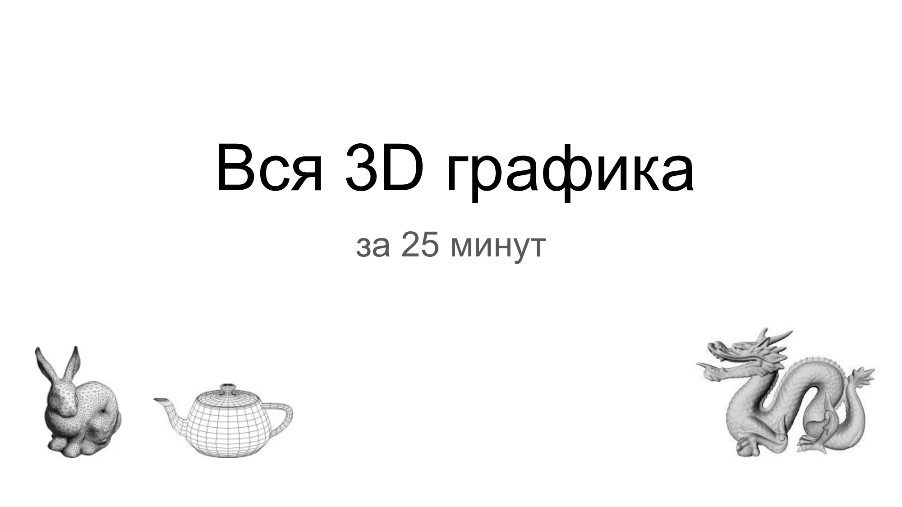

# Вся 3D графика за 25 минут

Как развивалась 3D графика. Задачи и пути их решения. Где мы сейчас?

## План

- Об авторе и почему он рассказывает про 3D графику.

- `Форма`. Почему треугольники?
- Настоящая `векторная графика`.
- `Цвет`. Почему точки?
- `Свет`. Ищем цвет точки и рисуем изображение.
- Зачем нужна `видеокарта`?
- `Графический конвейер`. Как работает видеокарта.
- `Шейдеры`. Что это такое и зачем? Графические фреймворки.
- `Графические движки` и среды разработки. Программист не нужен.
- `Десктоп` тоже 3D. 2D = 3D - 1.
- `PBR`. Физически корректный рендеринг.
- Epic `Unreal Engine 5`. Nanite + Lumen
- NVIDIA `RTX` 20xx. "Лучи" - не главный прорыв.
- `Нейросети` за 30 секунд. И как их строить (за 30 секунд).
- `DLSS`, Deep Learning Super Sampling.

- `Визитка` + глоссарий.

Доп. секция

- `Воксели` и марширующие кубики.
- `Псевдослочайный шум`. Как влияет на качество изображения.
- `SDF`, Signed Distance Fields.

## Место проведения

Владимир, ул.Горького 87 (Учебный корпус №1 [Владимирского государственного университета](https://yandex.ru/maps/-/CCUVeVVItB)), конф.зал 335.

## Hints

### Get PNG slides with ImageMagick

> $ sudo apt-get install imagemagick

### ImageMagic PDF restrictions

> convert-im6.q16: attempt to perform an operation not allowed by the security policy `PDF' @ error/constitute.c/IsCoderAuthorized/408.

- Open `/etc/ImageMagick-6/policy.xml`
- Change policy for PDF: `<policy domain="coder" rights="read | write" pattern="PDF" />`

### HowTo get PNG slides

> convert -density 200 foo.pdf ./res/foo_%02d.png

Produces series of PNG files like: `foo_00.png`, `foo_01.png`, ...
